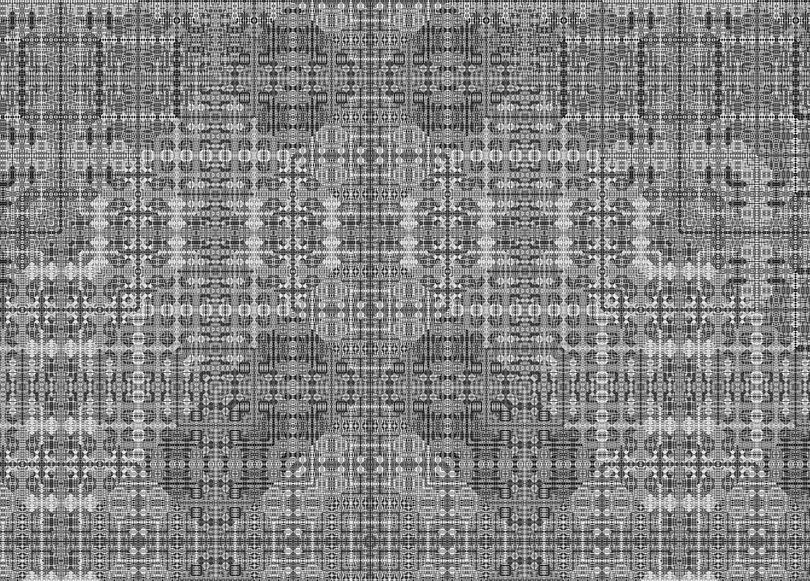

# RSA xor — infinite explorer

An interactive, infinitely pan/zoomable renderer of the "RSA xor" image, a pattern
originally discovered by **mccann**, who came up with it while messing around with
the RSA encryption algorithm
([RSA xor on DeviantArt](https://www.deviantart.com/mccann/art/RSA-xor-153857)). Each
pixel is computed directly from its integer coordinates, so the plane is unbounded —
you can scroll and zoom in any direction forever, and every cell is generated on the
fly.

The whole thing is a single self-contained `mod257.html` (no build step, no
dependencies). Just open it in a browser.

**Live demo: [inhahe.com/mod257](https://inhahe.com/mod257/)**



## The algorithm

For a cell at world coordinate `(x, y)`:

```
temp        = |x + y|  xor  |x - y|
pixel[x,y]  = (temp ^ 7) mod 257
```

The value is in `0..256` (mod 257 has 257 possible results), which is mapped to a
grayscale or color palette.

### Two render modes

Press **`a`** to toggle between them:

- **authentic** (default) — reproduces mccann's *original* image (linked above).
  mccann computed `temp^7` in floating point and then reduced `mod 257`
  (`fmod(pow(temp, 7), 257)`), not exact modular arithmetic. For `temp` larger than
  ~190, `temp^7` exceeds a double's 53-bit mantissa, so the low bits are lost — and
  that rounding is exactly what produces the extra grain/texture that makes the image
  look interesting. This matches the sample image pixel-for-pixel to the eye.
- **clean** — the mathematically exact `(temp^7) mod 257` via modular exponentiation.
  It depends only on `temp mod 257`, so it's smoother and more regular.

### Exact xor at large coordinates

JavaScript's bitwise operators only work on 32-bit integers, but coordinates can
range far past that. The xor is done on two 32-bit limbs (hi/lo), keeping it exact to
about `2^53`. Because `2^32 ≡ 1 (mod 257)`, the final reduction can just add the hi
and lo halves mod 257 — no BigInt needed.

## Controls

| Input | Action |
|---|---|
| **drag** | pan |
| **wheel** | zoom (toward the cursor) |
| **← ↑ → ↓** | pan |
| **`+` / `-`** | zoom in / out (toward screen center) |
| **`0`** | reset to origin, 1× zoom |
| **`a`** | toggle authentic / clean mode |
| **`c`** | toggle color / grayscale |
| **`g`** | goto — jump to an entered `x, y` center coordinate |
| **`s`** | save the current view as a PNG |
| **`h`** | hide / show all overlay panels |

Zoom ranges from `1/16777216×` (very far out, one screen sample covers many cells) to
`41×` (each cell drawn as a large block of screen pixels).

## HUD

All overlays live in a single top-left column, stacked in this order:

1. **Live readout** — the **center** world coordinate, the **cursor** world coordinate
   and its computed cell **value**, the current **zoom**, and the active **mode**.
2. **Keyboard legend** — the list of shortcuts.
3. **Formula** — a one-line label showing how each pixel is derived from its `(x, y)`
   coordinate: `Formula: gray(x, y) = ( (|x+y| xor |x−y|)^7 ) mod 257`.

Press **`h`** to collapse/expand all three panels at once; a toast confirms how to
bring them back.

### Touch / mobile

On touch or narrow (≤760px) devices the keyboard legend is replaced by an on-screen
**control bar** along the bottom (zoom, reset, color, mode, goto, save, and an **info**
toggle). The live-readout and formula panels stay in the top-left, and the touch bar's
**info** button shows/hides exactly those two top panels (the legend is already hidden
on mobile) — so the formula stays visible on mobile and can be toggled from the bottom
bar.

## Files

- `mod257.html` — the entire application (algorithm, rendering, UI).
- `rsa_xor_1783838638436.png`, `rsa_xor_1783838752348.png` — views captured from the
  explorer via the save-PNG feature.
- `todo.txt` — the original project brief / algorithm description.

## Running

No server or build required — open `mod257.html` in any modern browser. (Serving the
folder over a local HTTP server also works if you prefer.)
